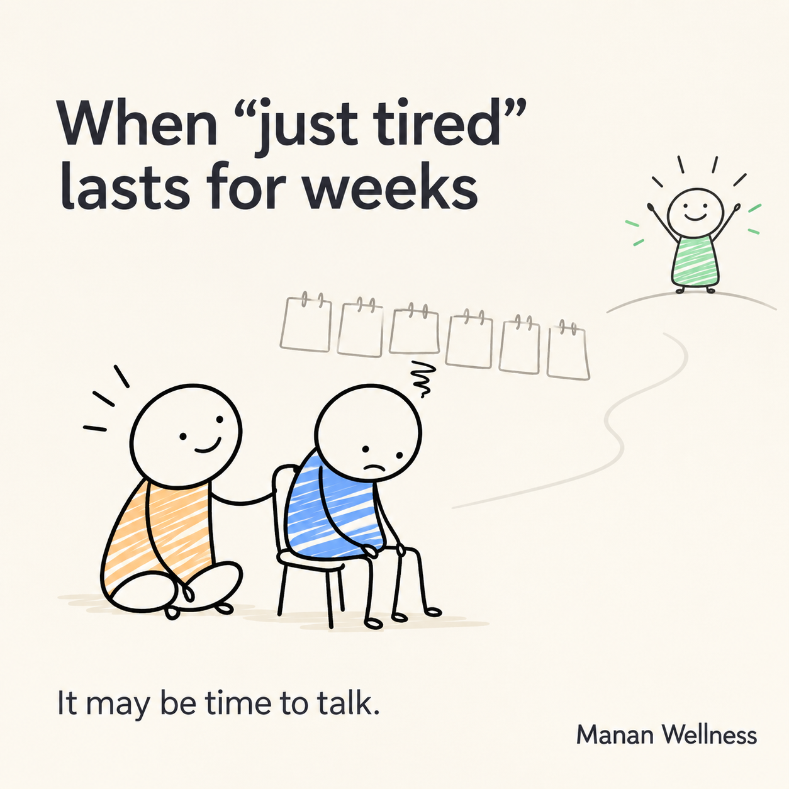

## Post copy

A patient told me last week, "I'm not depressed, doctor. I'm just tired all the time."

I asked her one question back: "How long have you been just tired?"

Six weeks, she said.

That pause — between "just tired" and six weeks — is where I spend most of my consultations.

Here's what years of practice have taught me: sadness and depression feel similar from the inside, but they behave very differently from the outside.

→ Sadness fades with time. Depression can sit there for weeks.
→ Sadness still lets a little joy in. Depression makes even a "good day" feel far away.
→ Sadness passes through your day. Depression can make getting through the day the entire task.

None of this is about willpower. Depression is a health condition, not a character flaw — and it responds well to the right support.

I'm genuinely curious: how do you personally know when a low mood has crossed from "rough patch" into "something I should talk to someone about"?

Tell me in the comments — I read every single one, and I promise, you won't be the only person asking.

#MentalHealthAwareness #DepressionAwareness #Psychiatry #MentalHealthMatters #WellnessJourney

## Notes
- Anecdote is illustrative/composite, not an identifiable patient case — reword further before posting if it needs to sound more like Dr. Pragati's own voice/phrasing.
- CTA is an open question designed to pull comments (curious persona), not a sales pitch.
- Suggest posting mid-week, morning IST for better reach.
