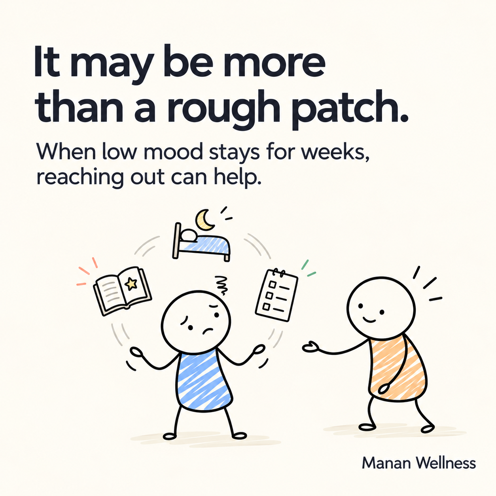

## Post copy

Most people wait months before telling anyone how they're really feeling.

Not because they don't notice something is off. But because it's easier to explain it away.

"I'm just tired."
"It's just work stress."
"It'll pass on its own."

Sometimes, it does.

But when a low mood has been there for weeks — not days — and even the things you used to enjoy stop feeling worth doing, it may not be "just a phase." It could be depression.

Depression is not a sign of weakness. It's a health condition — as real as a thyroid problem — and one of the most treatable mental health conditions there is.

A few signs that are easy to miss or dismiss:

→ Feeling exhausted even after a full night's sleep
→ Losing interest in things you used to look forward to
→ Small, everyday tasks suddenly feeling heavy
→ Trouble concentrating, or feeling irritable more often than usual

None of these mean something is "wrong" with you. They mean your mind may be asking for support.

What's one myth about depression you've heard that you now know isn't true? We'd love to bust a few in the comments.

And if this reminds you of someone — a friend, a colleague, someone in your family — consider quietly sending it their way. Sometimes that quiet nudge is what someone needs to finally reach out.

Manan Wellness offers confidential, compassionate mental health care in Raipur and Bilaspur. You don't have to figure this out alone.

#MentalHealthMatters #DepressionAwareness #MananWellness #YouAreNotAlone #MentalHealthRaipur

## Notes
- Engagement hook (myth-busting) is intentionally low-disclosure — asks for opinions/knowledge, not personal experience, since this audience is not comfortable discussing their own struggles publicly.
- CTA also offers a private/indirect action (send to someone quietly) rather than only a public one, matching the "not open to discuss in public" persona.
- Clinic CTA kept soft (no hard sell) — awareness first, service mention second.
